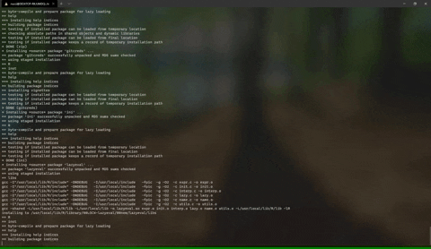

# Table of Contents

* [Overview](#overview)
* [Repository Structure](#repository-structure)
* [Container List](#container-list)
* [Bug Reporting and Requesting Features](#bug-reporting-and-requesting-features)
* [Contributing Guidelines](#contributing-guidelines)
* [License](#license)
* [Troubleshooting](#troubleshooting)

# Overview

Welcome to the ICDS container collection! Here you can find the Docker and Singularity containers that are built by the community or by the techs that are members of the i-ASK Software Engineers team. This repository is hosted in the hopes that the traveling researcher or post-undergraduate student well find the container solution that the need for their workflow. If you have any questions, then please feel free to open an issue on this repository! If you are interested in adding more containers to this repository, keep reading! 

# Repository Structure

This is brief overview of where all the relevant files are stored in this repository:

* **`/docker`** - Where all the Dockerfiles are stored.
* **`/singularity`** - Where all the singularity definition files are stored.
* **`/share/doc`** - Where the documentation to help you get started working with Singularity and Docker is stored.
* **`/share/gifs`** - Where the gifs you see in this README are stored.

# Container List

## Docker

Here is the list of Dockerfiles currently stored in this repository:

* **r-base-3.6.3** - a basic container for R 3.6.3 built on top of Debian Bullseye.
* **r-base-4.0.3** - a basic container for R 4.0.3 built on top of Debian Bullseye.
* **rstudio** - a container with RStudio and R 4.0.3 installed together.

## Singularity

Here is the list of Singularity Definition Files currently stored in this repository:

* **cadabra2** - a field theory motivated approach to computer algebra ([website](https://cadabra.science/)).
* **calc** - C-style arbitrary precision calculator ([website](http://isthe.com/chongo/tech/comp/calc/index.html)).
* **climb** - Composite Likelihood Empirical Bayes ([website](https://github.com/hillarykoch/CLIMB)).
* **custom** - a hodgepodge of miscellanious but useful containers.
* **hicpro** - An optimized and flexible pipeline for Hi-C data processing ([website](https://github.com/nservant/HiC-Pro)).
* **laynii** - Stand alone fMRI software suite for layer-fMRI analyses ([website](https://github.com/layerfMRI/LAYNII)).
* **libbi** - LibBi is used for state-space modelling and Bayesian inference on high-performance computer hardware, including multi-core CPUs, many-core GPUs (graphics processing units) and distributed-memory clusters ([wesbite](https://libbi.org/index.html)).
* **nlopt** - a free/open-source library for nonlinear optimization ([website](https://nlopt.readthedocs.io/en/latest/)).
* **rstudio** - an IDE for writing your R code and applications ([website](https://www.rstudio.com/)).
* **selenium** - a browser automation tool ([website](https://www.selenium.dev/)).

# Bug Reporting and Requesting Features

* [Reporting Bugs](#reporting-bugs)
* [Requesting Features](#requesting-features)

## Reporting Bugs

If you encounter any bugs or any *oddities* when working with the container source code stored in this collection, please open an issue on this repository. In that issue, please include the following sections:

1. Which container are you using?
2. What are you trying to accomplish?
3. The stacktrace of the error you are receiving.

The more information the better. We cannot fix the problem if we do not know how it is being caused. Also, when you open the issue, please label the issue as a **bug**.

## Requesting Features

If there is a new container you would like to see added to this collection, please open an issue on this repository. While we cannot promise that every requested container will be added, we will at least give it a look! Also, when requesting a feature as an issue, please label the issue as a **feature request** or **enhancement**.

# Contributing Guidelines

If you would like to help us add to the this container collection by either fixing issues, adding new containers, or updating the container to new versions, please create a fork of this repository. In that fork, create a branch that alludes to what you are trying to accomplish.

After completing the work in your branch, please open a pull request to the main repository. In your pull request, please include the following things:

1. What did you add/modify in your branch?
2. Why did you make the addition/modification?

Once again, the more information you include the better! Once we review the pull request, we will determine if it should be merged or not! If we say no, we will comment why.

# License

This repository is licensed under the permisive MIT License. For more information on what this license entails, please feel free to visit https://en.wikipedia.org/wiki/MIT_License.

# Troubleshooting

If you encounter any issues while working with, building, or modifying any container stored in this collection, please open an issue on this repository or email iask@ics.psu.edu. In that issue/email, please describe the issue that you are having, and please explain what you are trying to do with the container. The more information the merrier!
